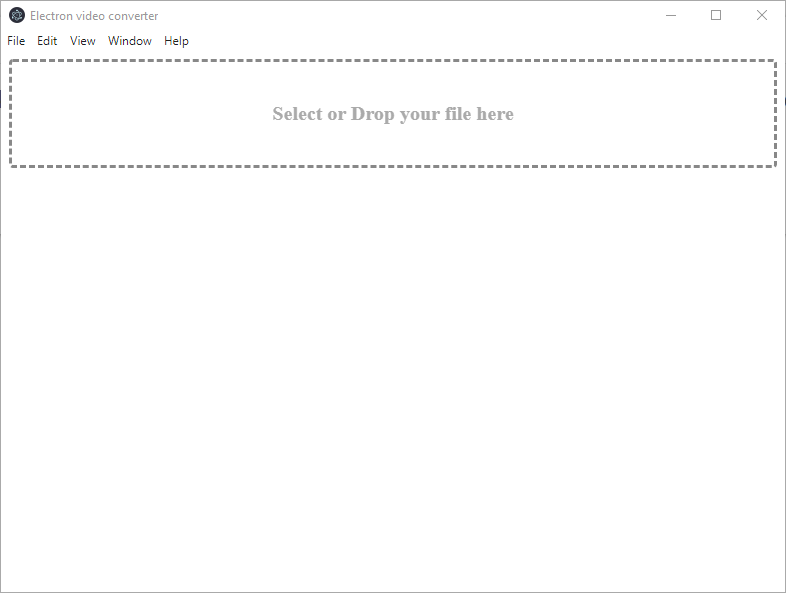
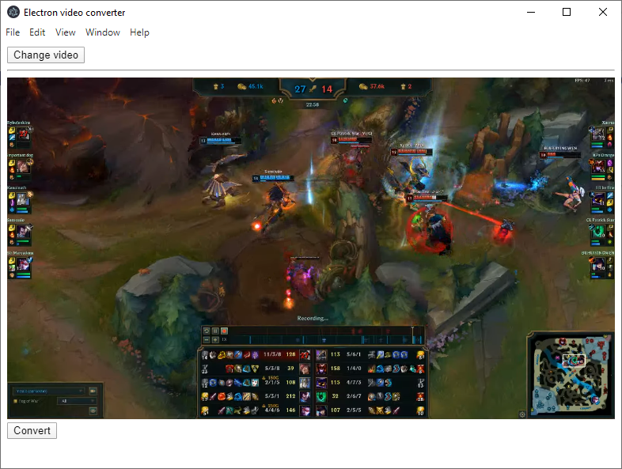
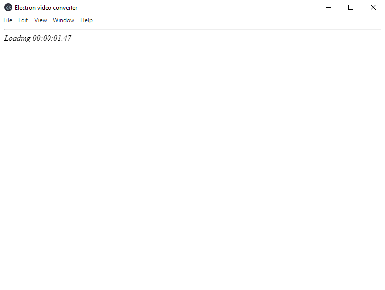
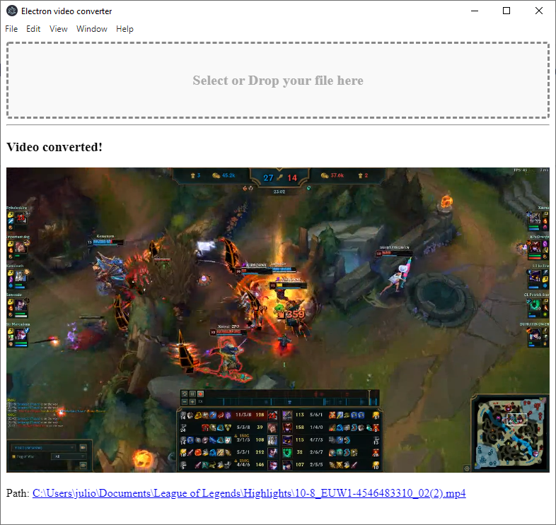

# Electron video converter
Electron + typescript video converter basic tool

## Start
```npm start```

## Manual Start
First we need to start react
```npm run start:react```

And then, start electron
```npm run start:electron```

## Build
```npm run build```

# Important
Right now, it only works with webm video files to mp4

# Screenshots




